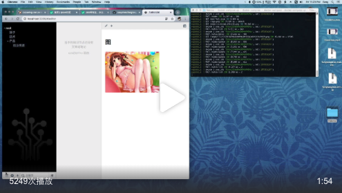

# 方糖知识树·镜像版

## 📼 教学视频

[](https://weibo.com/1088413295/Igrj1gOT9)

## 👨🏻‍💻 开发过程

此项目为 [方糖全栈课·React+Node版](http://node.quanzhanke.com) 必修课部分的实战项目，课程有对整个开发过程做详细的教学，感兴趣的同学可[点击购买](http://node.quanzhanke.com)。


## ⚒ 安装

### 配置参数

打开 `Docker-compose.yaml` ，修改13~15行环境变量：

- IMAGEBASE：图片链接前缀，如果只想支持本网站，可以用 `/image/`，如果想支持客户端，就需要把你最终部署的服务器URL写到前边，比如`http://yourdomain.com:port`。
- REGKEY：注册码，为防止内容风险，可以设置注册码拦截未知用户注册，不想设置等号后留空即可。
- SECRET：用来加密session和cookie的密钥，可填写一个较长的英文和数字字串

### 启动

```
docker-compose up 
```

## 🌲 使用 

### 网页版 

访问 yourip.com:port/ 即可看到网页版界面。

### 客户端 

- 下载：[微云下载](https://share.weiyun.com/553iNEA)
- 登入时，点击「登入」按钮右侧的三角图标可以设置API服务器，填入上边网页版地址即可。

## 数据备份

### 树和文章

直接通过菜单中的「导出知识树」就能导出，但这部分数据不包括图片。

### 图片备份

图片目录就在 运行 `docker-compose up` 的目录下，名为 `image`。

## License

镜像可随意使用，项目代码保留版权。
